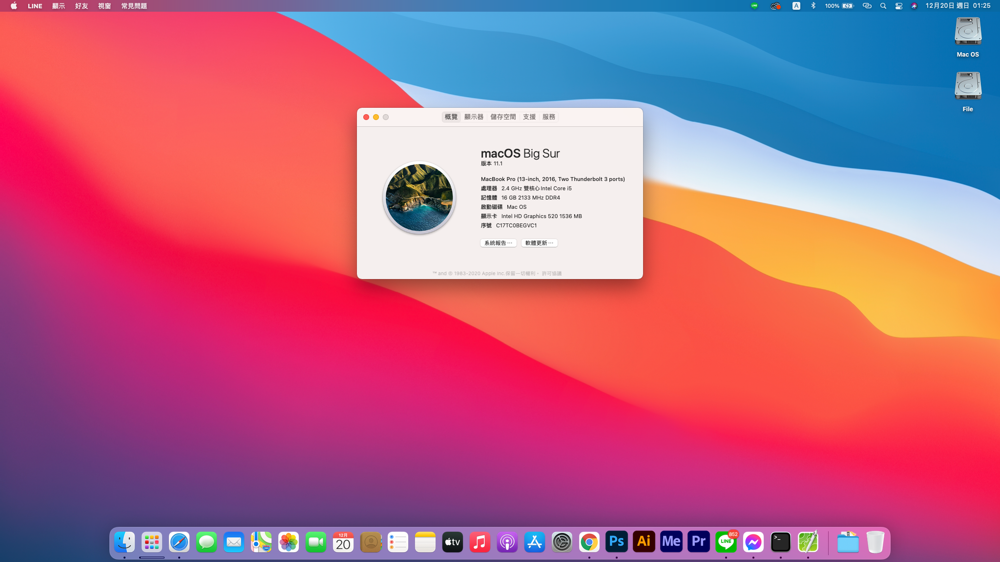

# HP 430 G3 Opencore for Big Sur

基于https://github.com/ryzenthreadripper9453/HP-430-G3-opencore的EFI做了修改，可以直接驱动G3上原来的intel无线网卡。

OpenCore 0.6.4 setup for running Hackintosh on HP ProBook 430 G3

### Laptop Specifications:
- Intel Core i5 6200U CPU (Skylake)
- Intel HD 520 Graphics
- 8GB DDR4-2133MHz RAM
- 13.3 1366x768 Display
- 原生intel无线网卡
- Synaptics PS2 TouchPad
- 2 USB 3.0 Ports, 1 USB 2.0 Ports
- HDMI Port
- SD Card Reader
- 西数SATA SSD 256G

### BIOS Setup:
- Disable Fast Boot
- Disable Power On when AC Detected
- Disable Power On when Lid is Opened
- Disable Secure Boot
- Disable Legacy Boot
- Enable Turbo Boost
- Enable Hyperthreading
- Enable Multi Processor
- Enable VT-x
- Disable Wake on LAN
- Video Memory Size: 64MB
- Enable Runtime Power Management
- Disable Extended Idle Power States
- Enable Deep Sleep
- Disable Wake when Lid is Opened
- Disable Wake on USB
- Enable Power Control

### What works:
- macOS Big Sur 11.1
- UEFI booting via OpenCore
- Built-in keyboard (with special function keys)
- Built-in trackpad (basic gestures)
- Brightness Control Hotkeys
- Audio Control Hotkeys
- HDMI Video and Audio
- Native Ethernet
- Native Wifi
- Native audio with AppleALC, including headphone
- Built-in mic
- Native power management
- Battery status
- Integrated Camera
- USB 3.0 Ports
- Ethernet
- Audio on internal speaker and headphone
- Sleep and Wake

### What doesn't work:
- FingerPrint Reader
- SD Card Reader
- Bluetooth and AirDrop

### Warning
- System time will be reset to 1999/12/31 08:00
- If you want to use iPhone hot spot,please use bcm94360ng
